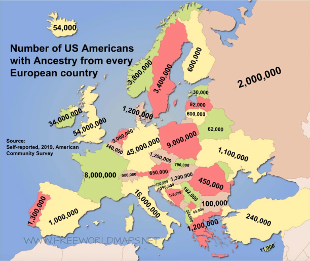
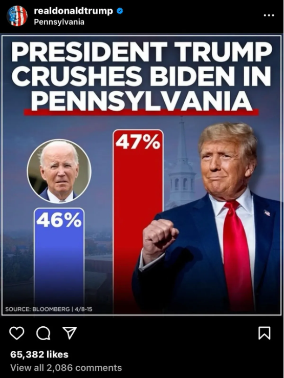
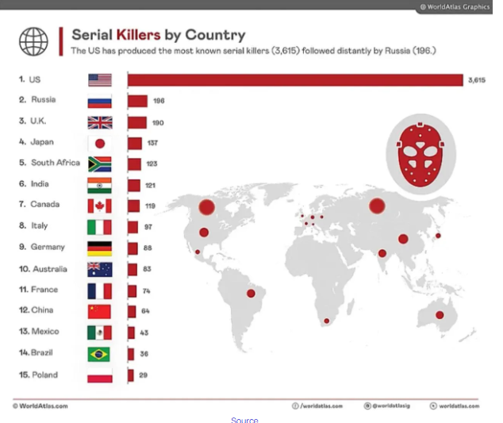

## 1. 

Le problème de cette carte est que les couleurs ne correspondent pas de manière cohérente aux valeurs, ici, une même couleur peut représenter des valeurs différentes. Pour la corriger, il faudrait utiliser un dégradé d'une seule couleur, avec des teintes claires pour les valeurs faibles et des teintes plus foncées pour les valeurs élevées.

## 2.

Sur ce graphique, on remarque un écart assez important entre les deux axes alors qu'en réalité les valeurs sont très proches, on note seulement un pourcent d'écart (46 % et 47 %). Pour le corriger, il faudrait utiliser une échelle adaptée, notamment en faisant commencer l'axe vertical à 0 et ainsi réduire l'écart trop grand entre les deux axes.

## 3.

Ce graphique compare le nombre total de tueurs en série entre plusieurs pays sans prendre en compte les différences de population, ce qui fausse la comparaison. Il faudrait plutôt présenter un taux par habitant et ajouter une légende claire à la carte afin d'expliquer ce que représentent les différents points.
