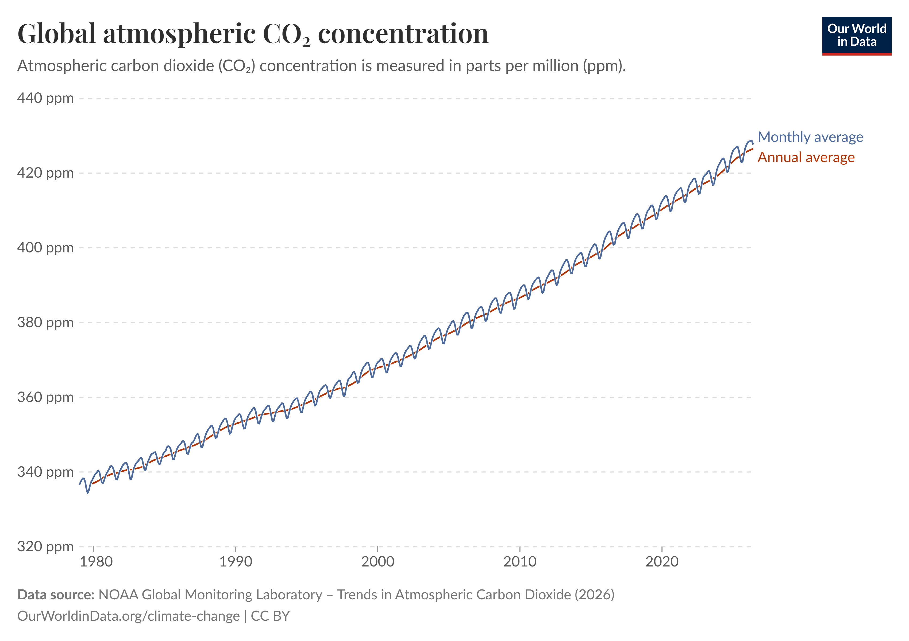
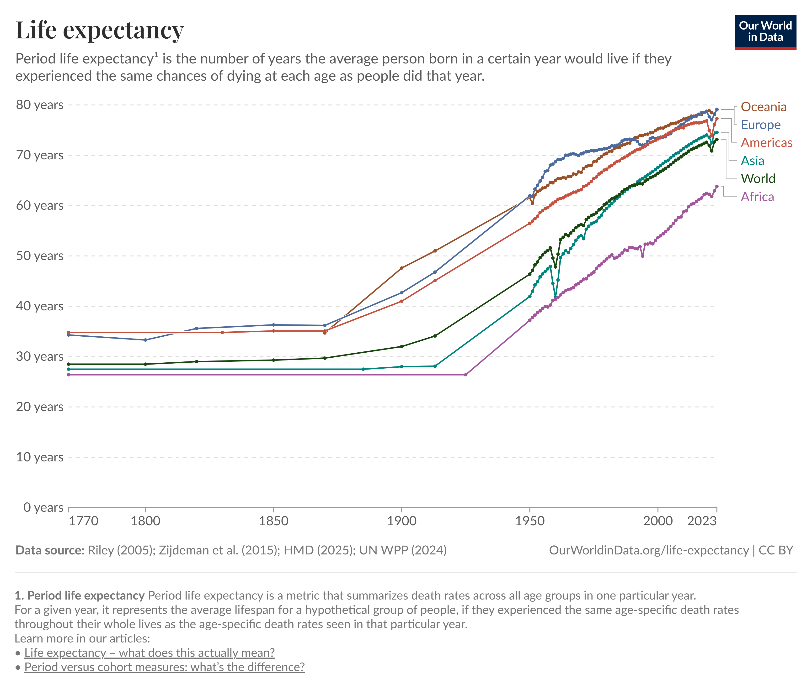
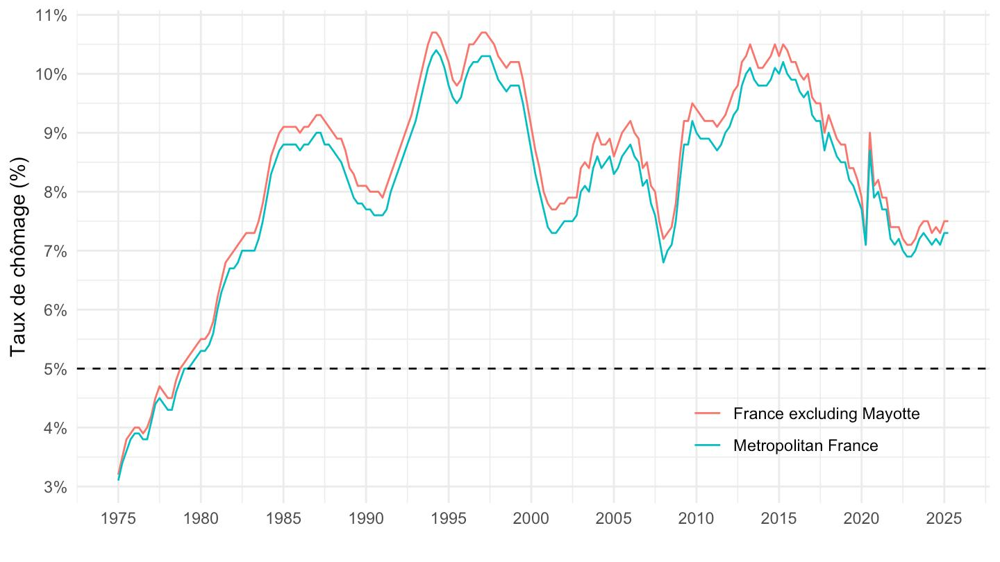

1. L'évolution de la concentration de CO₂ dans l'atmosphère

Ce graphique montre l'évolution de la concentration de CO₂ dans l'atmosphère au fil du temps. La courbe permet de voir clairement la tendance générale à la hausse et de repérer les périodes où cette augmentation s'accélère. Le diagramme en ligne est adapté, car il met en évidence une évolution continue sur une longue période.

2. L'évolution de l'espérance de vie dans plusieurs pays

Ce graphique utilise plusieurs courbes pour comparer l'évolution de l'espérance de vie dans différents pays. Il permet de voir que l'espérance de vie augmente globalement sur le long terme, mais pas au même rythme partout. Les couleurs permettent de distinguer les pays et de comparer facilement leurs trajectoires. 

3. L'évolution du taux de chômage en France — INSEE

Ce graphique représente l'évolution du taux de chômage en France depuis 1975. Il permet de repérer les périodes de hausse et de baisse, notamment le pic de 2015 et la diminution observée ensuite. Le graphique en ligne est pertinent, car il facilite la lecture des fluctuations et de la tendance générale sur plusieurs décennies.
